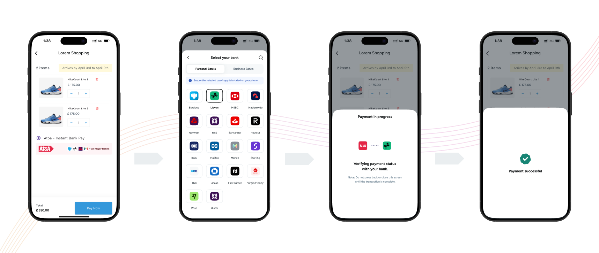

# Atoa React Native SDK

The official React Native SDK for integrating Atoa Payments into mobile applications.

[](https://www.npmjs.com/package/@atoapayments/atoa-react-native-sdk)
[](https://opensource.org/licenses/MIT)



## Overview

The Atoa React Native SDK allows merchants to easily integrate Atoa Payments into their React Native applications. The SDK provides a simple imperative API for showing a payment page that handles the entire payment flow securely and efficiently.

- [Installation](#installation)
- [Peer Dependencies](#peer-dependencies)
- [Usage](#usage)
- [Complete Demo App](example/src/App.tsx)
- [Handle Redirection](#handle-redirection-optional)

## Installation

```sh
npm install @atoapayments/atoa-react-native-sdk
```

or

```sh
yarn add @atoapayments/atoa-react-native-sdk
```

## Peer Dependencies

The SDK requires the following peer dependencies to be installed in your project:

```sh
npm install react-native-svg lottie-react-native react-native-reanimated react-native-gesture-handler @gorhom/bottom-sheet @react-native-community/netinfo
```

### Additional Setup

#### react-native-reanimated

Add the Reanimated Babel plugin to your `babel.config.js`:

```js
module.exports = {
  presets: ['module:@react-native/babel-preset'],
  plugins: ['react-native-reanimated/plugin'],
};
```

#### react-native-gesture-handler

Import at the top of your app entry file (e.g. `index.js`):

```js
import 'react-native-gesture-handler';
```

#### Font Linking

After installing, link the FigTree font assets:

```sh
npx react-native-asset
```

### iOS

Run pod install:

```sh
cd ios && pod install
```

## Usage

Sample code to integrate can be found in [example/src/App.tsx](example/src/App.tsx).

#### Import Package

```typescript
import { AtoaSdk } from '@atoapayments/atoa-react-native-sdk';
import type { TransactionDetails, AtoaPayOptions } from '@atoapayments/atoa-react-native-sdk';
```

#### Show Payment Sheet

It's a full screen sheet which shows all the available bank list then once user selects the bank. They can confirm the bank details and get redirected to their bank app or website.

```typescript
const options: AtoaPayOptions = {
  paymentId: 'your-payment-request-id',
  env: 'sandbox', // or 'prod'
  showHowPaymentWorks: false,
  customerDetails: {
    // pass customer details for pre-select bank
    phoneCountryCode: '44',
    phoneNumber: '8788899999',
    email: 'customer@example.com',
  },
  onUserClose: ({ paymentRequestId, redirectUrlParams, signature, signatureHash }) => {
    // handle payment when user closes the payment verification bottom sheet
    console.log(`User closed payment for paymentRequestId: ${paymentRequestId}`);
  },
  onPaymentStatusChange: ({ status, redirectUrlParams, signature, signatureHash }) => {
    // handle payment status
    console.log(`Payment Status Changed to ${status}`);
  },
  onError: (error) => {
    // handle Atoa Mobile SDK error
    console.error(`Error in Atoa SDK: ${error.message}`);
  },
};

const paymentDetails = await AtoaSdk.pay(options);
```

### Customer Details for Previously Used Banks

The SDK supports displaying banks the customer has previously paid with through the `customerDetails` parameter:

#### Important Notes About Customer Details

- **Uniqueness**: The `customerDetails` should be a unique identifier for each customer in your system.
- **Persistence**: When a customer completes a payment, the bank they used is remembered and associated with this customerDetails.
- **Returning Customers**: For returning customers, providing the same `customerDetails` allows the SDK to offer the option to pay with banks they've previously used.
- **Security**: The information about previously used banks is securely stored by Atoa, not in your application.
- **Optional**: This parameter is optional. If not provided, each payment will be treated as a new transaction without showing previously used banks.

#### Best Practices

- Use a consistent and unique identifier from your system (e.g., user ID, customer reference).
- Keep the same `customerDetails` across all payments for the same customer to ensure continuity of previously used banks.
- Consider user consent and data privacy regulations when implementing this functionality.

## API Reference

#### Parameters

- `options`: Configuration object (required)
  - `env`: The Atoa environment to use (`'sandbox'` | `'prod'`)
  - `paymentId`: The payment request ID (required)
  - `showHowPaymentWorks`: Shows a sheet which explains the steps for making a payment (required)
  - `customerDetails`: Customer details for the payment (optional)
  - `onError`: Error callback function (optional)
  - `onPaymentStatusChange`: Callback for payment status updates (optional)
  - `onUserClose`: Callback when payment dialog is closed (optional)

#### Detailed SDK Options

##### Environment

- Type: `AtoaEnv` (`'sandbox'` | `'prod'`)
- Required: Yes
- Description: Specifies which Atoa environment to use for the payment

##### Payment Request ID

- Type: `string`
- Required: Yes
- Description: Unique identifier for the payment request

##### Show How Payment Works

- Type: `boolean`
- Required: Yes
- Description: Shows a sheet which explains the steps for making a payment

##### Customer Details

- Type: `CustomerDetails`
- Required: No
- Description: Customer information for the payment. When provided, the SDK will use this information to fetch the last bank used by the customer for payment, improving the user experience by showing their preferred bank first.

```typescript
interface CustomerDetails {
  phoneCountryCode?: string;
  phoneNumber?: string;
  email?: string;
}
```

##### Event Handlers

###### onError

- Type: `(error: AtoaException) => void`
- Description: Called when an error occurs during the payment process
- Parameters:
  - `error`: Error object containing:
    - `message`: Error message
    - `type`: Error type (`'custom'` | `'notInitialized'` | `'noDataFound'` | `'environmentNotSet'`)
    - `amount`: (optional) Payment amount
    - `referenceId`: (optional) Reference identifier
    - `time`: (optional) Error timestamp

###### onPaymentStatusChange

- Type: `(params: { status: string; redirectUrlParams?: Record<string, string>; signature?: string; signatureHash?: string }) => void`
- Description: Called when the payment status changes
- Parameters:
  - `status`: Current payment status
  - `redirectUrlParams`: (optional) Additional callback parameters
  - `signature`: (optional) Atoa signature for verification
  - `signatureHash`: (optional) Atoa signature hash for verification

###### onUserClose

- Type: `(params: { paymentRequestId: string; redirectUrlParams?: Record<string, string>; signature?: string; signatureHash?: string }) => void`
- Description: Called when the user cancels the payment
- Parameters:
  - `paymentRequestId`: The payment request ID
  - `redirectUrlParams`: (optional) Additional callback parameters
  - `signature`: (optional) Atoa signature for verification
  - `signatureHash`: (optional) Atoa signature hash for verification

## Handle Response

You can handle the payment success, failure, pending and other statuses based on payment response:

```typescript
import { AtoaSdk, isCompleted } from '@atoapayments/atoa-react-native-sdk';

const paymentDetails = await AtoaSdk.pay(options);

if (paymentDetails != null) {
  if (isCompleted(paymentDetails)) {
    // handle success
  } else {
    // handle failure / pending statuses
  }
} else {
  // Bottom sheet was dismissed or encountered an error
}
```

#### Transaction Status Values

| Status | Description |
|--------|-------------|
| `COMPLETED` | Payment completed successfully |
| `PENDING` | Payment is being processed |
| `FAILED` | Payment failed |
| `REFUNDED` | Payment was refunded |
| `AWAITING_AUTHORIZATION` | Waiting for bank authorization |
| `CANCELLED` | Payment was cancelled |
| `EXPIRED` | Payment link expired |
| `PAYMENT_NOT_INITIATED` | Payment was not initiated |

Sample response can be seen [here](https://docs.atoa.me/introduction#step-3-handle-payment-status).

## Handle Redirection (Optional)

While calling [payment-process](https://docs.atoa.me/api-reference/Payment/process-payment) API to generate a payment, you can specify a `redirectUrl` in your request body. The `redirectUrl`, which should be passed as body parameters, redirects to your website and then opens your app via deep linking. This enables users to open your application after payment.

For journeys including web and mobile, you can use App Links for Android and Universal Links for iOS.

Both are special types of deep links that you can set as your redirect URL, but these must use either the http or https URI schemes.

Note: When a deep link has a custom URI scheme (not http or https) it will link to content that can only be accessed if the application is installed on the device.

There are 3 cases, after redirection to a given redirect URL:

1. If you handled the deep links and they work, then the user is redirected to the app.
2. If deep links are not handled, the user will redirect to the web browser.
3. If deep links are handled and fail to redirect to the app, the user will redirect to the web browser to the given redirect URL.

Note: If deep links are handled and fail to redirect to the app, you can add a 'Return to app' UI in your redirect page, so that users can manually click and redirect to the app. If not, users can manually switch to the app after payment.

### Android

Add intent-filter to handle deep links in `android/app/src/main/AndroidManifest.xml`.

Replace `devapp.atoa.me` with your own web domain and `/sdk-redirect` with your path.

```xml
<intent-filter android:autoVerify="true">
  <action android:name="android.intent.action.VIEW" />
  <category android:name="android.intent.category.DEFAULT" />
  <category android:name="android.intent.category.BROWSABLE" />
  <data android:scheme="https" />
  <data android:host="devapp.atoa.me" />
  <data android:path="/sdk-redirect" />
</intent-filter>
```

### iOS

Add the associated domains configuration in your Xcode project:

1. In Xcode, select your target > Signing & Capabilities > + Capability > Associated Domains
2. Add your domain: `applinks:devapp.atoa.me` (replace with your own domain)

Or manually update your `.entitlements` file:

```xml
<?xml version="1.0" encoding="UTF-8"?>
<!DOCTYPE plist PUBLIC "-//Apple//DTD PLIST 1.0//EN" "http://www.apple.com/DTDs/PropertyList-1.0.dtd">
<plist version="1.0">
  <dict>
    <key>com.apple.developer.associated-domains</key>
    <array>
      <string>applinks:devapp.atoa.me</string>
    </array>
  </dict>
</plist>
```

And add URL types to `Info.plist`. Replace `devapp.atoa.me` with your own web domain:

```xml
<dict>
  <key>CFBundleTypeRole</key>
  <string>Editor</string>
  <key>CFBundleURLSchemes</key>
  <array>
    <string>https</string>
  </array>
  <key>CFBundleURLName</key>
  <string>devapp.atoa.me</string>
</dict>
```

## Checking Bank App Installation

The SDK checks if the user's selected bank app is installed on the device. For this feature to work, you need to declare the bank app schemes/packages in your app configuration.

### Android

Add the `queries` tag in `android/app/src/main/AndroidManifest.xml`:

```xml
<queries>
  <package android:name="com.barclays.android.barclaysmobilebanking" />
  <package android:name="com.starlingbank.android" />
  <package android:name="com.grppl.android.shell.CMBlloydsTSB73" />
  <package android:name="uk.co.hsbc.hsbcukmobilebanking" />
  <package android:name="com.rbs.mobile.android.natwest" />
  <package android:name="co.uk.Nationwide.Mobile" />
  <package android:name="com.grppl.android.shell.halifax" />
  <package android:name="com.rbs.mobile.android.rbs" />
  <package android:name="uk.co.santander.santanderUK" />
  <package android:name="com.revolut.revolut" />
  <package android:name="co.uk.getmondo" />
  <package android:name="com.grppl.android.shell.BOS" />
  <package android:name="ftb.ibank.android" />
  <package android:name="uk.co.tsb.newmobilebank" />
  <package android:name="com.firstdirect.bankingonthego" />
  <package android:name="com.virginmoney.uk.mobile.android" />
  <package android:name="uk.co.ybs.savings.external" />
  <package android:name="com.transferwise.android" />
  <package android:name="com.nearform.ptsb" />
  <package android:name="com.bankofireland.mobilebanking" />
  <package android:name="aib.ibank.android" />
  <package android:name="uk.co.bankofscotland.businessbank" />
  <package android:name="com.chase.intl" />
</queries>
```

### iOS

Add `LSApplicationQueriesSchemes` key in `ios/<YourApp>/Info.plist`:

```xml
<key>LSApplicationQueriesSchemes</key>
<array>
  <string>pulsesecure</string>
  <string>launchbmb</string>
  <string>lloyds-retail</string>
  <string>hsbc-pwnwguti5z</string>
  <string>uk.co.santander.santanderUK</string>
  <string>fb894703657238109</string>
  <string>bos-retail</string>
  <string>halifax-retail</string>
  <string>monzo</string>
  <string>starlingbank</string>
  <string>tsbmobile</string>
  <string>comfirstdirectbankingonthego</string>
  <string>launchFT</string>
  <string>virginmoneyimport</string>
  <string>ybssavings</string>
  <string>transferwise</string>
  <string>tg</string>
  <string>BOIOneAPP</string>
  <string>ie.aib.mobilebanking</string>
  <string>bos-commercial</string>
  <string>chase-international</string>
</array>
```

#### Resources for Deep Linking

- [React Native Linking Documentation](https://reactnative.dev/docs/linking)
- [Set up App Links for Android](https://developer.android.com/training/app-links)
- [Set up Universal Links for iOS](https://developer.apple.com/documentation/xcode/supporting-universal-links-in-your-app)

## Example App

The [example](example/) directory contains a complete demo app showing how to integrate the SDK. To run it:

```sh
cd example
npm install

# iOS
cd ios && pod install && cd ..
npx react-native run-ios

# Android
npx react-native run-android
```

For any issues or inquiries, please contact hello@paywithatoa.co.uk.

## License

MIT © [Atoa Payments Limited](https://github.com/ATOAPaymentsLimited)
